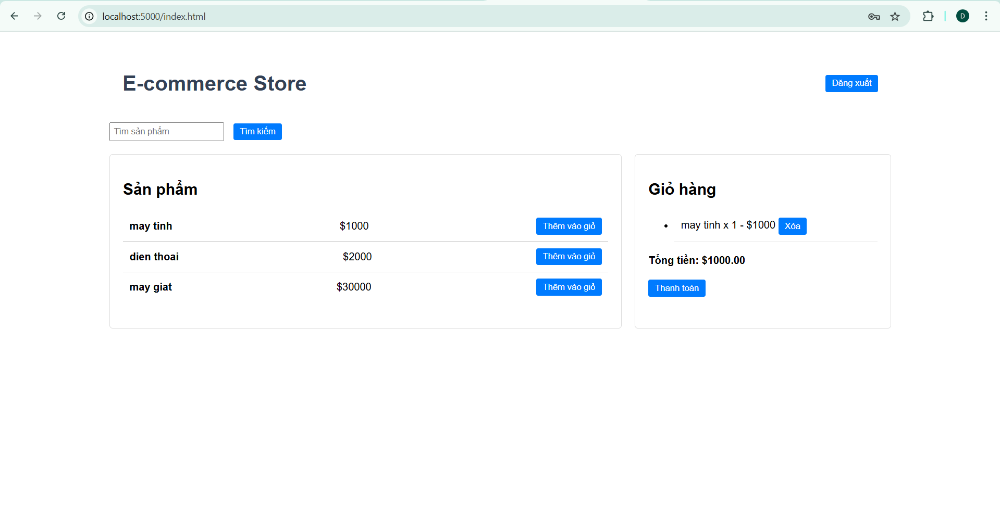
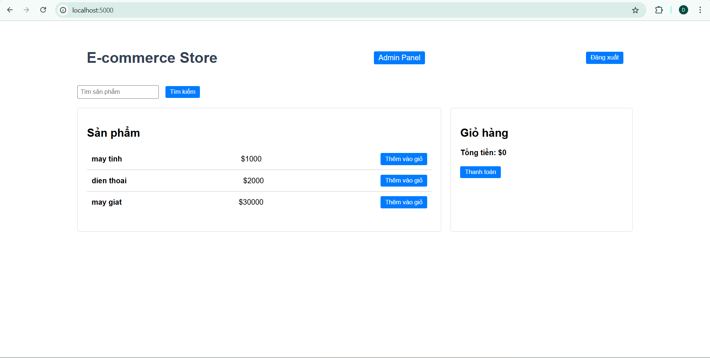
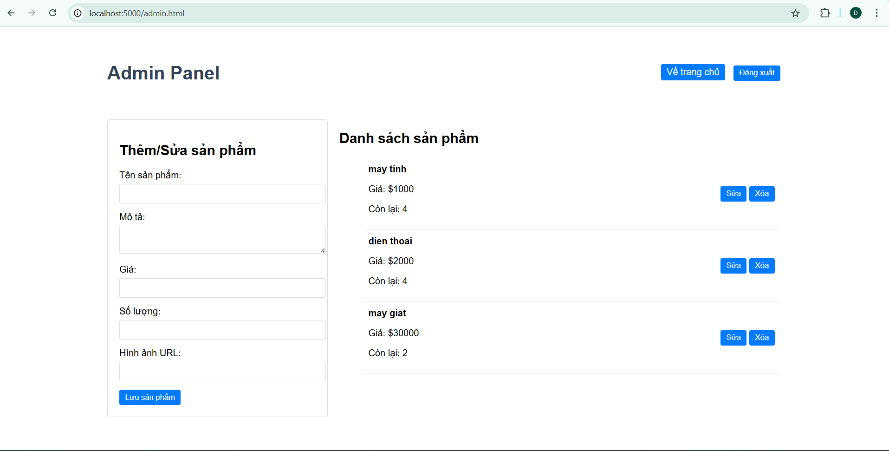
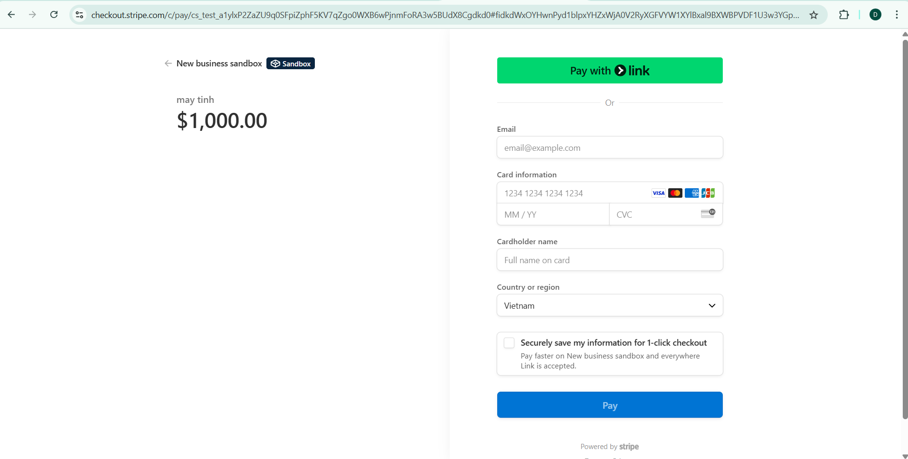

# E-Commerce API

This project is a full-featured E-Commerce backend API built with Node.js, Express, and MongoDB.  
It supports user authentication via JWT, product & cart management, and Stripe payment integration.  
A minimal front-end (HTML/CSS/JS) is included to demonstrate API usage.

This project is implemented based on [E-Commerce API project on roadmap.sh](https://roadmap.sh/projects/ecommerce-api)

---

## Tech Stack

- **Backend:** Node.js, Express.js
- **Database:** MongoDB (with Mongoose)
- **Authentication:** JWT
- **Payment Gateway:** Stripe
- **Frontend:** HTML, CSS, JS

---

### Authentication
- User Signup & Login
- JWT-based token protection
- Admin role support

### Products
- Create / Read / Update / Delete products
- Search by name
- Pagination support

### Cart
- Add to cart
- Remove from cart
- View cart per user

### Checkout (Stripe)
- Create checkout session with Stripe
- Redirect to secure Stripe Checkout page

---

## Getting Started

### 1. Clone the repo

```bash
git clone https://github.com/dtduc-ptit/E-Commerce-API.git
cd E-Commerce-API
```

### 2. Install dependencies

```bash
npm install
```

### 3. Create .env file

```bash
PORT=5000
MONGODB_URI=your_url
JWT_SECRET=your_secret_key
JWT_REFRESH_SECRET=your_refresh_key
STRIPE_SECRET_KEY=your_key
```

### 4. Run web

```bash
npm start
```
Server will run at: http://localhost:5000
Access basic front-end UI at: http://localhost:5000

## Frontend

Giao diện người dùng đơn giản được xây dựng bằng HTML/CSS/JS để tương tác với API.

---

### 🏠 Giao diện chính cho người dùng


---

### 🔎 Giao diện chính cho admin


---

### Giao diện chỉnh product cho admin


---

### Trang thanh toán
